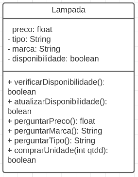
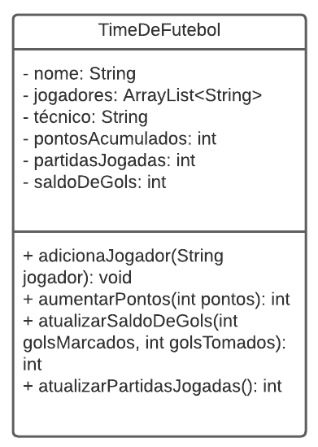

### BMQuestao1:


### BMQuestao02:



### BMQuestao3:

```java
void mostraDados(){
    //restante do código
    if(contaEEspecial==true&&saldo<0) System.out.println("Saldo negativo!");
    //restante do código
}
```
### BMQuestao4:

Questão implementada no arquivo Lampada.java: [Lampada.java](Lampada.java)

### BMQuestao6:

```java
void abreContaSimples(String nome, float valor){
    if(valor>=100.00f){
        saldo = valor;
        nomeDoConcorrista = nome;
        contaEEspecial = false;
    } 
    else{
        System.out.println("Não é possível abrir a conta com esse saldo");
    }
}
```

### BMQuestao7:

O erro está no seguinte trecho do código:
```java
class Registro De Eleitor
```
Nesse trecho, fica perceptível que o nome da classe está separada por espaço em branco, algo que não é permitido. Para corrigir esse erro, devemos usar um upper camel case para nomear essa classe. Ficaria assim:
```java
class RegistroDeEleitor
```

### BMQuestao08:

Na questão abaixo o erro se encontra no tipo de retorno,
pois a função retorna boolean, ao invés de int
```java
int maior()
{
    if (num1 > num2)
        return true;
    else return false;
}
```
Além disso, também há um erro quanto ao tipo de retorno, pois a função foi declarada como não possuindo retorno,
no entanto, ela retorna um valor int.

````java
void menor()
{
    if (num1 < num2)
        return num1;
    else return num2;
}
````

### BMQuestao09:

O erro no código abaixo é a ausência do tipo de retorno do método main

```java
class TesteImpressao
 {
main(String[] args)
{
System.out.println("7+2="+(7+2));
System.out.println(“7-2=”+(7-2));
System.out.println(“7*2=”+(7*2));
System.out.println(“7/2=”+(7/2));
return true;
}
}
```
